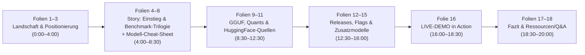

# 🦙 Präsentationsplan (20-Minuten-Version): llama.cpp – Lokale Inferenz ohne Overhead

> **Format:** 16:9 Widescreen PowerPoint ([`llama_cpp_20min_praesentation.pptx`](file:///c:/Users/Arved\Desktop\llama_präsi\llama_cpp_20min_praesentation.pptx))  
> **Dauer:** exakt 20:00 Minuten (inkl. 2.5 Min. Live-Demo & Q&A)  
> **Publikum:** Entwickler, Architekten, Tech-Leads, Data Scientists  
> **Design-Stil:** Minimalistischer Retro-Engineering-Stil in **Bahnschrift** (DIN 1451 Ästhetik), matte Charcoal-/Slate-Farbpalette, keine überladenen Untertitel, maximale Übersichtlichkeit  
> **Interaktive Navigation:** Durchgängige 6-teilige Kapitel-Leiste am oberen Rand jeder Folie (`01 LANDSCHAFT` · `02 BENCHMARKS` · `03 GGUF & QUANTS` · `04 SETUP` · `05 LIVE-DEMO` · `06 FAZIT`) mit Live-Highlighting des aktuellen Themas und klickbaren Folien-Sprungzielen  
> **Kernthese:** *llama.cpp ist das effizienteste Werkzeug für Single-Stream-, CPU- und Edge-Szenarien. Für unzählige interne Tools braucht man keinen teuren Cloud- oder GPU-Cluster. Modelle wie Qwen 3.8 oder Gemma 4 schlagen frühere Cloud-Standards lokal auf Consumer-Hardware.*

---

## ⏱️ Zeit- & Folienübersicht (18 Folien, genau 20 Min)

| Nr. | Titel | Themen & Kernelemente | Zeit |
| :---: | :--- | :--- | :---: |
| **1** | **Titel & Eisbrecher** | Rick & Morty Meme (Censys) · Lokale Inferenz ohne Daemon-Overhead | 1:00 Min |
| **2** | **Die Inferenz-Landschaft** | Querformat-Tabelle (Ollama → llama.cpp → K-Transformers → vLLM → SGLang) | 1:30 Min |
| **3** | **Positionierung: Wann llama.cpp?** | Prototyping, Single-Stream, CPU, Apple Silicon, Mobile · Bell Curve Meme groß | 1:30 Min |
| **4** | **Euer KI-Einstieg: ChatGPT oder Claude?** | Interaktive Publikumsfrage: Wer war bei GPT-3.5/GPT-4 dabei? Wer nutzt Claude Opus? | 0:45 Min |
| **5** | **Benchmark 1: ChatGPT-Familie** | Fullscreen-Index: GPT-4o (Score 9) bis GPT-6 Astra (Score 53) | 0:45 Min |
| **6** | **Benchmark 2: Claude-Familie** | Fullscreen-Index: Claude 3 Opus (Score 9) bis Opus 4.6 (Score 32) & 5.5 (58) | 0:45 Min |
| **7** | **Benchmark 3: Open-Weights Realität** | Fullscreen-Index mit Markierungen: Grün = Top-Empfehlungen, Gelb = Nuancen & Vorbehalte | 1:00 Min |
| **8** | **Cheat Sheet: Empfohlene Modelle** | Modell-Matrix mit VRAM-Footprint (Q4 vs Q8, KV-Cache, Drafter/MTP, mmproj) | 1:15 Min |
| **9** | **Das GGUF-Ökosystem** | Single-File Container, zero-copy mmap, Split-Offload · Memes: „WEN GGUF“ & Arsenal | 1:15 Min |
| **10** | **Quantisierungs-Mastery** | 8-Bit No-Brainer · 4-Bit Sweet Spot · KV-Cache Quantisierung (-ctk/-ctv) · Faustformel · Memes | 1:30 Min |
| **11** | **GGUF-Quellen auf Hugging Face** | **Unsloth** (Release-Radar) & **Underdog AesSedai** ([Eis Se-dai] · FP8 mmproj VRAM-Hack) | 1:15 Min |
| **12** | **Download-Kompass: Win & Linux** | Entscheidungsbaum: Blackwell (CUDA 13) vs. älter (CUDA 12) + cudart-Pflicht! · CPU x64/arm64 | 1:00 Min |
| **13** | **Download-Kompass: Mac & Mobile** | macOS Apple Silicon (Metal nativer RAM) · Pocket AI Lab (iOS) · LM Playground (Android OSS) | 1:00 Min |
| **14** | **In 3 Schritten starten & Flags** | ZIP entpacken → GGUF ablegen → Server starten · Cheatsheet (`-m`, `-c`, `-ctk/-ctv`, `--mmproj`, `-md`, `-t`, `--port/--host`) | 1:00 Min |
| **15** | **Zusatzmodelle: Vision & Turbo** | Vision mit `--mmproj` (AesSedai FP8-Tipp!) · Speculative Decoding (`-md`) & MTP (1.5x–2.5x Speedup) | 1:00 Min |
| **16** | **LIVE-DEMO in Action** | Split-Screen: Terminal-Logs, WebUI, OpenAI-API Drop-In (Continue.dev, Cursor, Cline, Open-WebUI) | 2:30 Min |
| **17** | **Der Architektur-Kompass** | Wann welches Tool? (llama.cpp vs. K-Transformers vs. vLLM vs. SGLang) · 5 Golden Takeaways | 0:45 Min |
| **18** | **Handout, Ressourcen & GitHub** | Vollflächiges Ressourcen- & Handout-Portal, GitHub-Repo, Web-UIs, Mobile Apps, Q&A | 0:45 Min |

---

## 📑 Detaillierte Folienbeschreibungen & Sprechernotizen

### Folie 1 · Titel & Humorvoller Eisbrecher
* **Visuals:** Hero-Card links (Single-Stream, Apps, Quants, Zero-to-Streaming), rechts Censys Rick & Morty Meme `assets/censys_exposed_instances.png` (*„What is my purpose? You run Ollama. Oh my god.“*).
* **Sprechernotiz:** *„Wer von euch hat schon mal eine dicke GPU gekauft – nur um darauf einen Ollama-Daemon laufen zu lassen? Heute klären wir in 20 Minuten, wie man das volle Potenzial der eigenen Hardware ohne unnötige Wrapper entfesselt.“*

---

### Folie 2 · Die Inferenz-Landschaft: Fünf Engines im Vergleich
* **Visuals:** Gestochen scharfe Tabelle im Querformat über alle 5 Frameworks.
* **Kern:** Trennung in *Dynamic / On-Demand* (Ollama, llama.cpp), *Hybrid* (K-Transformers) und *Pre-allocated High-Throughput* (vLLM, SGLang).
* **Sprechernotiz:** *„Es gibt zwei Welten: Links wird Speicher erst bei Bedarf belegt – ideal für Laptops und gemischte Server. Rechts reservieren vLLM und SGLang sofort 90 % eures VRAMs für PagedAttention, um Hunderte parallele Nutzer zu bedienen. K-Transformers ist die Sonderrolle für riesige MoE-Modelle mit Gewichten im System-RAM.“*

---

### Folie 3 · Positionierung: Wann llama.cpp?
* **Visuals:** Breite Karte links (Einsatzfelder: Prototyping, Single-Stream, CPU, Apple Silicon, Mobile) und rechts groß das Bell-Curve-Meme `assets/memes/meme6_bell_curve.png` mit Zitat *„4B on CPU is plenty for my use“*.
* **Kern:**
  * **Wann llama.cpp?** Prototyping in Sekunden, Single-Stream Hintergrund-Tasks, Alt-Server/CPU, Apple Silicon Unified Memory, Mobile Apps (Pocket AI Lab & LM Playground).
  * **Die Macht kleiner Apps:** 90 % interner Workflows brauchen keinen H100-Cluster – 20 bis 50 T/s reichen völlig aus!
  * **Pragmatismus:** Die Bell Curve der lokalen Inferenz: Am Anfang Überforderung, in der Mitte VRAM-Kaufrausch, am Ende pragmatischer CPU/Edge-Betrieb.
* **Sprechernotiz:** *„Am Anfang will man die größte Cloud-GPU. In der Mitte sucht man nachts um 2 Uhr nach gebrauchten GPUs auf eBay. Am Ende stellt man fest: Für interne Automatisierungen reicht ein kompaktes 4B–8B Modell auf bestehender CPU völlig aus.“*

---

### Folie 4 · Euer KI-Einstieg: Seid ihr mit ChatGPT oder mit Claude gestartet?
* **Visuals:** Zwei große Karten (Team ChatGPT / OpenAI & Team Claude / Anthropic) mit exakten Release-Daten aller Modelle + Reflexions-Banner unten.
* **Inhalt & Release-Chronologie:**
  * **Team ChatGPT / OpenAI:**
    * `GPT-3.5` (Nov. 2022) · Der globale Aha-Moment für Text- & Chatgenerierung.
    * `GPT-4` (März 2023) · Der Quantensprung: Echtes Reasoning & Code-Verständnis.
    * `GPT-4o` (Mai 2024) · Blitzschnell, multimodal – der weltweite Cloud-Standard.
    * `GPT-5` (Aug. 2025) & `5.2` (Dez. 2025) · Der Sprung in autonomes Agenten-Reasoning.
    * `GPT-5.5` (Apr. 2026) & `GPT-6 Astra` (Sept. 2026) · Test-Time Compute & Frontier-Spitze.
  * **Team Claude / Anthropic:**
    * `Claude 3 Opus` (März 2024) · Erster Meilenstein, der GPT-4 im Coden spürbar deklassierte.
    * `Claude 3.5 Sonnet` (Juni 2024) · Der globale De-facto-Standard für Entwickler-Tools.
    * `Claude Opus 4` (Mai 2025) & `4.5` (Nov. 2025) · Mathematisches Reasoning & Multi-File-Coding.
    * `Claude Opus 4.6` (Feb. 2026) & `5.5` (Sept. 2026) · Die Benchmark-Spitze proprietärer Modelle.
* **Interaktion:**
  1. *„Wer von euch war bei ChatGPT 3.5 oder GPT-4 dabei?“*
  2. *„Und wer nutzt heute bevorzugt Claude für Architektur & Code?“*
* **Sprechernotiz:** *„Erinnert ihr euch an das Gefühl, wie unerreichbar gut sich GPT-4 oder Claude 3 damals anfühlten? Schauen wir uns an, wo diese Modelle heute im Artificial Analysis Index stehen – und wie viel dieser Intelligenz ihr heute lokal und offline betreiben könnt!“*

---

### Folie 5 · Benchmark 1: Wo steht die ChatGPT-Familie heute?
* **Visuals:** Fullscreen-Chart `assets/benchmarks/benchmark_openai.png` mit hervorgehobenen OpenAI-Säulen und Info-Card.
* **Sprechernotiz:** *„Schaut euch GPT-4o (Mar) an: Score 9! Dieser weltweite Standard von 2024 ist heute der unterste Balken der Grafik. GPT-5.2 liegt bei 30, GPT-5.5 bei 38. Behaltet diesen Score von 9 und 30 im Kopf!“*

---

### Folie 6 · Benchmark 2: Wo steht die Claude-Familie?
* **Visuals:** Fullscreen-Chart `assets/benchmarks/benchmark_anthropic.png` mit Terrakotta-Highlights für Anthropic-Modelle.
* **Sprechernotiz:** *„Für die Claude-Fraktion: Claude 3 Opus steht ebenfalls bei Score 9! Opus 4.6 liegt bei Score 32. Und jetzt kommt die entscheidende Frage: Wo stehen die frei herunterladbaren Open-Weights-Modelle?“*

---

### Folie 7 · Benchmark 3: Open-Weights Realitäts-Check: Lokale Intelligenz auf Augenhöhe
* **Visuals:** Fullscreen-Chart `assets/benchmarks/benchmark_open_weights.png` mit grünen und gelben Markierungspfeilen.
* **Sprechernotiz:**
  * *„Grüne Pfeile: Qwen 3.8 Flash-Next steht bei Score 40 – schlägt GPT-5.5 (38) und deklassiert Opus 4.6 (32)!“*
  * *„Qwen 3.8 27B steht bei Score 34 – läuft quantisiert auf einem MacBook oder einer RTX 4090 und übertrifft Claude Opus 4.6!“*
  * *„Gemma 4 E4B erreicht Score 9 – genau das Niveau von GPT-4o und Claude 3 Opus, aber lokal!“*
  * *„Gelbe Pfeile: K2 Horizon MoVA (Score 25) ist spannend, aber die llama.cpp Unterstützung ist noch ganz frisch. Nemotron 3.5 Lightning ist qualitativ 'meh', hat aber 100% offene Trainingsdaten!“*

---

### Folie 8 · Cheat Sheet: Die besten Open-Weights Modelle für llama.cpp
* **Visuals:** Strukturierte 4-Karten-Matrix mit exakten VRAM-Berechnungen (Q4 vs Q8, KV-Cache, Drafter/MTP, mmproj) + Support-Vorbehalt unten.
* **Inhalt & VRAM-Rechnung:**
  1. **High-End Reasoning & Coding:** Qwen 3.8 (Flash-Next & 27B) | Score 40 | Q4: ~16.5 GB, Q8: ~29.5 GB | KV-Cache: 8k FP16 ~2.5 GB → Q8 ~1.2 GB | Drafter: +0.8 GB | VRAM Total Q4: ~18.5 GB (ideal für 24 GB GPU / 32 GB RAM); Q8: ~33 GB.
  2. **Multimodale Allrounder:** Google Gemma 4 (E4B & 12B) | Score 9 (Audio + Vision nativ!) | 4B: Q4 ~2.8 GB / Q8 ~4.5 GB; 12B: Q4 ~7.5 GB / Q8 ~13.5 GB | mmproj: BF16 ~1.8 GB → FP8 ~0.9 GB (AesSedai!) | Total 4B Q4: ~4.1 GB (Budget-Laptops); 12B Q4: ~8.8 GB (12 GB GPU).
  3. **Ultra-Effizienz & Edge:** Liquid AI LFM 2.5 (1.2B-Thinking & 2.6B) | 1.2B: Q4 ~0.8 GB; 2.6B: Q4 ~1.7 GB | KV-Cache minimal (<0.3 GB) | Total: ~1.1 GB – 3.2 GB | Rasante CPU-, Pi- & Smartphone-Inferenz.
  4. **100% Offene Trainingsdaten:** Nvidia Nemotron 3.5 Lightning (8B) | Score 13 | Q4: ~5.1 GB, Q8: ~9.2 GB | Total Q4: ~6.2 GB (8 GB Laptop-GPU); Q8: ~10.3 GB | Volle Compliance & DSGVO-Transparenz.
  5. **Support-Vorbehalt:** K2 Horizon MoVA 36B (Score 25) – llama.cpp Support aktuell noch experimentell.

---

### Folie 9 · Das GGUF-Ökosystem: Warum es die Open-Source-Welt regiert
* **Visuals:** Links die 4 Superkräfte (Single-File, mmap Zero-Copy, Split-Offload, Hardware-agnostisch), rechts Memes `meme1_wen_gguf.jpg` und `meme3_meme_arsenal.jpg`.
* **Sprechernotiz:** *„Sobald Meta oder Qwen neue Gewichte veröffentlichen, fluten binnen 5 Minuten Kommentare wie 'WEN GGUF?' Hugging Face. Weil erst mit GGUF 95% aller Entwickler das Modell überhaupt auf Consumer-Hardware booten können.“*

---

### Folie 10 · Quantisierungs-Mastery: Mythen, Fakten & Empfehlungen
* **Visuals:** Farbige Übersicht (16→8 Bit, 4-Bit Sweet Spot, KV-Cache Quantisierung mit `-ctk/-ctv`, 5/6-Bit Ineffizienz, Sub-4-Bit Warnung) + Faustformel. Rechts: Oben Unsloth GLM-Meme (`meme4_glm4_gguf.jpeg`), unten El Risitas Meme (`meme2_careful_gguf_quants.jpeg` – *„Its smaller they said, its optimized they said“*).
* **Sprechernotiz:** *„16-Bit zu 8-Bit (Q8_0) ist geschenkter Speicher. Mit `-ctk q8_0 -ctv q8_0` quantisieren wir auch den KV-Cache und halbieren den RAM-Bedarf langer Kontexte. Und die Faustregel: Größeres Modell in 4-Bit schlägt IMMER ein kleineres Modell in 8-Bit!“*

---

### Folie 11 · GGUF-Quellen auf Hugging Face: Unsloth & Geheimtipp AesSedai
* **Visuals:** 2 große Karten für Unsloth und AesSedai + Bottom Banner.
* **Inhalt:**
  * **Unsloth (`huggingface.co/unsloth`):** Daniel & Michael Han-Chen. Der schnellste Release-Radar der Community mit erstklassigen Dynamic Quants.
  * **Geheimtipp AesSedai (`huggingface.co/AesSedai`):**
    * **Aussprache:** *„Eis Se-dai“* (aus Robert Jordans *Das Rad der Zeit*).
    * **Der FP8-VRAM-Hack:** Baut **FP8-Versionen von `mmproj`** (Vision Projector), die meist voll kompatibel mit Unsloth-Sprachmodellen sind! Spart Hunderte MB bis GB VRAM.
* **Sprechernotiz:** *„Bookmarkt diese beiden Repos! Und nutzt bei Bildverarbeitung den AesSedai-Trick, um den Vision Encoder schlank in FP8 zu laden.“*

---

### Folie 12 · Download-Kompass: GitHub Releases (Windows & Linux)
* **Visuals:** Eingebetteter Entscheidungsbaum `download_windows.png` + Callout-Box mit CUDA-Regel & Linux-Äquivalent.
* **Sprechernotiz:** *„Release-Seite aufrufen, Entscheidungsbaum folgen: Bei Nvidia (Blackwell = CUDA 13, älter = CUDA 12) immer das zweite Archiv (`cudart-...`) mitladen und in denselben Ordner entpacken!“*

---

### Folie 13 · Download-Kompass: macOS & Mobile Ökosystem
* **Visuals:** Eingebetteter Entscheidungsbaum `download_apple_mobile.png`.
* **Sprechernotiz:** *„Auf Apple Silicon (M1–M5) ist Metal automatisch aktiv – Unified Memory teilt sich RAM und VRAM ohne Kopiervorgang. Am Smartphone immer Wrapper-Apps nutzen: Pocket AI Lab für iOS, LM Playground für Android.“*

---

### Folie 14 · In 3 Schritten starten & Die wichtigsten CLI-Flags
* **Visuals:** Oben 3 Schritte (ZIP entpacken → GGUF ablegen → Server starten). Unten Cheatsheet-Tabelle mit 7 Schlüssel-Flags (`-m`, `-c`, `-ctk/-ctv`, `--mmproj`, `-md`, `-t`, `--port/--host`).
* **Sprechernotiz:** *„Neu und unverzichtbar: `-ctk q8_0 -ctv q8_0` halbiert den KV-Cache. `--mmproj` schaltet Vision/Audio scharf. Und `-md` aktiviert Speculative Decoding mit einem kleinen Drafter für 2- bis 3-fachen Speedup vor allem bei Dense-Modellen. Reasoning- und Tool-Parser erkennt llama.cpp automatisch!“*

---

### Folie 15 · Zusatzmodelle: Vision (`--mmproj`) & Turbo mit Draft / MTP
* **Visuals:** Links Vision-Modelle (Zwei-Dateien-Prinzip + AesSedai FP8-Hack), rechts Speculative Decoding & MTP.
* **Sprechernotiz:** *„Mit `--mmproj` macht ihr jedes multimodale Modell offline-fähig für OCR und Rechnungsanalyse. Und mit `-md` (Draft-Modell) prüft das große Modell mehrere Token-Vorschläge in einem Vorwärtsdurchlauf: 1.5x bis 2.5x Durchsatz bei identischer Qualität!“*

---

### Folie 16 · LIVE-DEMO: `llama-server` in Action & API Drop-In
* **Visuals:** Links Demo-Checkliste & Drop-in Clients, rechts Tokens/s-Wette mit dem Publikum.
* **Ablauf & Bring-Your-Own-Key Tools:**
  1. Terminal öffnen & Server starten (`./llama-server -m qwen27b.gguf -c 8192 -ctk q8_0 -ctv q8_0`).
  2. Logzeilen zeigen: mmap Ladezeit (<1s), VRAM-Allokation, Token-Timings.
  3. Browser auf `http://localhost:8080`: Frage stellen & Streaming-Geschwindigkeit zeigen.
  4. Prompt-Caching demonstrieren.
  5. Drop-in OpenAI API (`http://localhost:8080/v1`): Beliebte Clients wie Continue.dev (VS Code/JetBrains), Cursor, Cline, Windsurf, Open-WebUI, LibreChat, AnythingLLM, Obsidian Copilot und Python SDK.

---

### Folie 17 · Der Architektur-Kompass & Die 5 Goldenen Takeaways
* **Visuals:** Entscheidungsbaum (Single-Stream → llama.cpp, Riesen-MoE → K-Transformers, Production Cluster → vLLM/SGLang) + 5 Takeaways.
* **Sprechernotiz:** *„Für interne Tools, Laptops und Edge: Startet mit llama.cpp. Wenn ihr 500 parallele Anfragen im Rechenzentrum bedienen müsst: vLLM oder SGLang.“*

---

### Folie 18 · Handout, Ressourcen & GitHub Repository
* **Visuals:** Vollflächige 2-Karten-Ressourcenübersicht + Q&A Banner unten.
* **Inhalt:**
  * **Card 1 (Hub & Cheat Sheets):** GitHub Repository Link, Druckfertiges A4-PDF `cheatsheets/handout.pdf`, GGUF & Quant Cheat Sheet, Unsloth AI & AesSedai Links.
  * **Card 2 (Engines, Clients & Benchmarks):** llama.cpp Releases, ggml Core, Coding Plugins (Continue.dev, Cursor, Cline), Web-UIs (Open-WebUI, LibreChat), Mobile Apps (Pocket AI, LM Playground), Artificial Analysis & LMSYS Arena.
  * **Banner:** *„Vielen Dank für eure Aufmerksamkeit! · Zeit für Fragen & Diskussion“*.
* **Sprechernotiz:** *„Vielen Dank! Alle Cheat Sheets, Folien und Skripte findet ihr im GitHub Repo und als druckfertiges PDF. Jetzt eröffnen wir die Fragerunde!“*

---

## 📂 Verknüpfte Projekt-Dateien

- 📊 **Fertige PowerPoint:** [`llama_cpp_20min_praesentation.pptx`](file:///c:/Users/Arved/Desktop/llama_pr%C3%A4si/llama_cpp_20min_praesentation.pptx)
- 📄 **Druckfertiges Handout (A4 Querformat):** [`cheatsheets/handout.pdf`](file:///c:/Users/Arved/Desktop/llama_pr%C3%A4si/cheatsheets/handout.pdf)
- 🖼️ **Vorschau-Bilder aller Folien:** Ordner [`slide_previews/`](file:///c:/Users/Arved/Desktop/llama_pr%C3%A4si/slide_previews/)
  - [Slide 04 (Publikumsfrage)](file:///c:/Users/Arved/Desktop/llama_pr%C3%A4si/slide_previews/slide_04.png)
  - [Slide 05 (Benchmark ChatGPT)](file:///c:/Users/Arved/Desktop/llama_pr%C3%A4si/slide_previews/slide_05.png)
  - [Slide 06 (Benchmark Claude)](file:///c:/Users/Arved/Desktop/llama_pr%C3%A4si/slide_previews/slide_06.png)
  - [Slide 07 (Benchmark Open Weights)](file:///c:/Users/Arved/Desktop/llama_pr%C3%A4si/slide_previews/slide_07.png)
  - [Slide 08 (Modell-Cheat-Sheet)](file:///c:/Users/Arved/Desktop/llama_pr%C3%A4si/slide_previews/slide_08.png)
- 🐍 **Generator-Skripte:**
  - [`generate_powerpoint.py`](file:///c:/Users/Arved/Desktop/llama_pr%C3%A4si/generate_powerpoint.py)
  - [`generate_benchmarks.py`](file:///c:/Users/Arved/Desktop/llama_pr%C3%A4si/generate_benchmarks.py)
