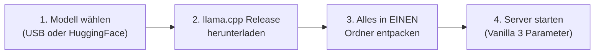

# 🦙 llama.cpp Self-Service Hub & Schnellstart-Guide

Herzlich willkommen! In diesem Ordner findest du alles, was du benötigst, um Modelle mit **llama.cpp** lokal auf deinem Laptop oder Desktop zum Laufen zu bringen – inklusive **Vision/Multimodalität** (`--mmproj`) und beschleunigtem **Speculative Decoding / Drafting** (`-md`).

Die Modelldateien (`.gguf`) stehen entweder direkt vor Ort auf den **USB-Sticks** bereit oder können über die Links im Katalog heruntergeladen werden.

---

## 🧭 In 4 Schritten zum laufenden Modell



---

### Schritt 1: Modell auswählen & bereitstellen

1. Öffne den vollständigen Modellkatalog:  
   👉 **[`models_list.md`](models_list.md)** *(Übersicht aller Modelle, VRAM-Bedarf, KV-Cache und direkte HuggingFace-Downloadlinks)*.
2. Wenn du vor Ort bist: Schnapp dir einen der **USB-Sticks** und kopiere die 3 zusammengehörigen Dateien für dein Setup:
   - **1. Basis-Modell (`-m`):** z. B. `gemma-4-E4B-it-qat-UD-Q4_K_XL.gguf` oder `Qwen3.8-27B-UD-Q4_K_XL.gguf`
   - **2. Vision Multimodal Projector (`--mmproj`):** z. B. `mmproj-BF16.gguf`
   - **3. Drafting / Speculative Model (`-md`):** z. B. `mtp-gemma-4-E4B-it-Q8_0.gguf` *(oder DSpark für Liquid AI)*
3. Falls du keinen USB-Stick hast: Nutze die direkten Downloadlinks in [`models_list.md`](models_list.md).

---

### Schritt 2: Das passende llama.cpp Release herunterladen

Offizielle Release-Seite von llama.cpp:  
👉 **[https://github.com/ggml-org/llama.cpp/releases](https://github.com/ggml-org/llama.cpp/releases)**

Orientiere dich an den beiliegenden Cheat Sheets in diesem Ordner:

| Betriebssystem / Hardware | Empfohlenes Archiv auf der Release-Seite | Cheat Sheet |
| :--- | :--- | :---: |
| 🪟 **Windows (Nvidia GPU)** | `llama-b<build>-bin-win-cuda-cu12.4-x64.zip`<br>*(oder `cu13.x` für Blackwell RTX 50er)*<br>⚠️ **Wichtig:** Lade auch die Datei `cudart-llama-bin-win-cu12.4-x64.zip` herunter! | [Windows Cheat Sheet](download_windows.png) |
| 🪟 **Windows (CPU only)** | `llama-b<build>-bin-win-avx2-x64.zip` | [Windows Cheat Sheet](download_windows.png) |
| 🍎 **macOS (Apple Silicon M1–M5)** | `llama-b<build>-bin-macos-arm64.zip`<br>*(nutzt n nativ Apple Metal und Unified Memory)* | [macOS Cheat Sheet](download_apple_mobile.png) |
| 🐧 **Linux (Nvidia / CPU)** | `llama-b<build>-bin-ubuntu-x64.zip` *(oder entsprechendes CUDA-Build)* | [Linux Cheat Sheet](download_linux.png) |

📄 **Druckfertiges A4-Handout:** [`handout.pdf`](handout.pdf)

---

### Schritt 3: Alles in **EINEN** Ordner entpacken

1. Erstelle einen beliebigen Arbeitsordner (z. B. `C:\llama_demo\` oder `~/llama_demo/`).
2. Entpacke das heruntergeladene llama.cpp ZIP-Archiv in diesen Ordner.
3. *(Windows Nvidia)*: Entpacke auch das `cudart-...zip` Archiv in denselben Ordner, sodass alle `.dll` Dateien neben `llama-server.exe` liegen.
4. Kopiere deine drei Modelldateien (`.gguf`) direkt in denselben Ordner:
   ```text
   mein_ordner/
   ├── llama-server (bzw. llama-server.exe)
   ├── ggml.dll / sonstige DLLs
   ├── gemma-4-E4B-it-qat-UD-Q4_K_XL.gguf    <-- Basismodell (-m)
   ├── mmproj-BF16.gguf                     <-- Vision Projector (--mmproj)
   └── mtp-gemma-4-E4B-it-Q8_0.gguf          <-- Draft Modell (-md)
   ```

---

### Schritt 4 (Nur macOS / Apple Silicon): Quarantäne-Attribut rekursiv entfernen! 🍎

> [!IMPORTANT]
> **macOS Gatekeeper blockiert aus dem Internet geladene Binärdateien.**  
> Beim ersten Ausführungsversuch meldet macOS sonst: *„llama-server kann nicht geöffnet werden, da Apple die Software nicht auf Schadsoftware überprüfen kann“* oder *„Permission denied“*.

Öffne ein Terminal in deinem entpackten Ordner und führe den Befehl mit dem **rekursiven Flag (`-r`)** aus, um das Quarantäne-Attribut von allen Binärdateien und Bibliotheken in einem Schritt zu entfernen:

```bash
xattr -r -d com.apple.quarantine .
```

*(Alternativ: `xattr -cr .`)*

Mache die Binärdatei ausführbar:
```bash
chmod +x llama-server
```

---

## 🚀 Schritt 5: Server starten (Vanilla Start-Befehle)

Hier sind die Startbefehle für die verschiedenen Betriebssysteme.  
**Absolut vanilla:** Nur der Server, das Basis-Modell (`-m`), der Vision-Projektor (`--mmproj`) und das Drafting-Modell (`-md`) – **keine weiteren Parameter!**

### 🪟 Windows (Eingabeaufforderung / PowerShell)
Öffne PowerShell oder CMD in deinem Ordner und starte:
```cmd
llama-server.exe -m gemma-4-E4B-it-qat-UD-Q4_K_XL.gguf --mmproj mmproj-BF16.gguf -md mtp-gemma-4-E4B-it-Q8_0.gguf
```

### 🍎 macOS (Terminal)
Öffne das Terminal in deinem Ordner und starte:
```bash
./llama-server -m gemma-4-E4B-it-qat-UD-Q4_K_XL.gguf --mmproj mmproj-BF16.gguf -md mtp-gemma-4-E4B-it-Q8_0.gguf
```

### 🐧 Linux (Bash)
Öffne dein Terminal im Ordner und starte:
```bash
./llama-server -m gemma-4-E4B-it-qat-UD-Q4_K_XL.gguf --mmproj mmproj-BF16.gguf -md mtp-gemma-4-E4B-it-Q8_0.gguf
```

*(Ersetze die Dateinamen einfach durch die Dateien des Modells, das du von der Liste gewählt hast.)*

---

## ✨ Und wie nutze ich es jetzt?

Sobald der Server gestartet ist, siehst du in der Konsole:
```text
llama_server_listen: HTTP server listening at http://127.0.0.1:8080
```

1. **Integrierte Web-Oberfläche:**  
   Öffne im Browser: **[http://localhost:8080](http://localhost:8080)**  
   Du kannst sofort chatten, Bilder für Bilderkennung hochladen und den Token-Durchsatz testen.

2. **OpenAI-kompatible API:**  
   Der Server bietet automatisch eine standardisierte REST-API unter:  
   `http://localhost:8080/v1/chat/completions`  
   Jedes Tool (Continue.dev, Cursor, Cline, Open-WebUI, LibreChat, Python `openai` SDK) funktioniert sofort als Drop-in Replacement!
